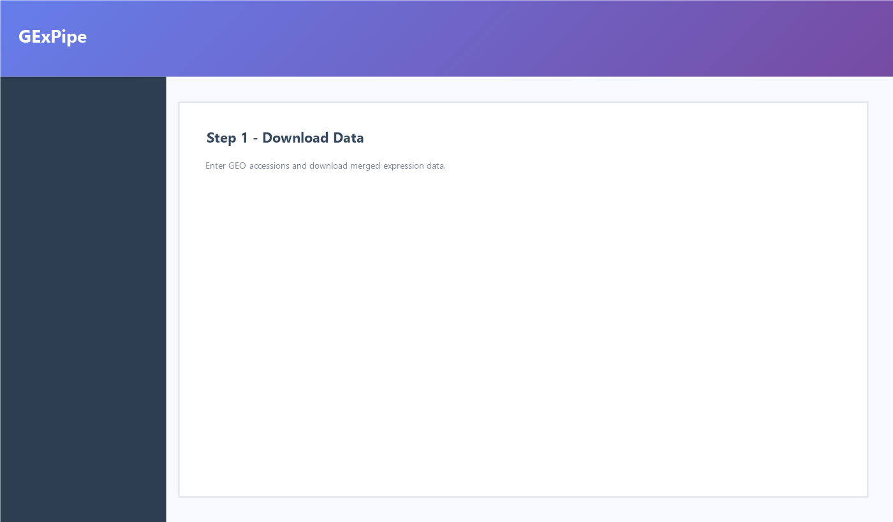

```{r setup, include=FALSE}
knitr::opts_chunk$set(
  collapse   = TRUE,
  comment    = "#>",
  warning    = FALSE,
  message    = FALSE,
  fig.width  = 7,
  fig.height = 5
)
```

# Introduction

`GExPipe` is a **Shiny application** for bulk RNA-seq and microarray
analysis. This vignette walks through the guided 15-step interface end to
end — download GEO data, run QC and normalization, correct batch effects,
discover differentially expressed genes, build co-expression networks,
refine candidates with PPI and machine learning, and export a clinical
summary report — without manually wiring separate Bioconductor tools
together. For mixed microarray studies (Arraystar, Affymetrix, Agilent,
custom probe IDs), the download step automatically runs **STEP 2b** to map
probes to HGNC gene symbols before merging — see
[Gene ID mapping](#gene-id-mapping-mixed-studies) below.

## Vignette outline

| Section | Purpose |
|------------------------------------|------------------------------------|
| [How the Shiny app is organised](#how-the-shiny-app-is-organised) | Pipeline overview figure |
| [Installation](#installation) | Bioconductor and GitHub install |
| [Run latest code for analysis](#run-latest-code) | Avoid stale installs; use `main` / `pkgload` |
| [Launch the Shiny application](#launch-the-shiny-application) | Start the app (`runGExPipe()` + `shiny::runApp()`) |
| [Step-by-step Shiny walkthrough](#step-by-step-shiny-walkthrough) | Screenshots and actions for all 15 steps |
| [Gene ID mapping](#gene-id-mapping-mixed-studies) | Probe / accession → symbol conversion (STEP 2b) |
| [Programmatic example](#programmatic-example-bundled-data) | Optional scripting with bundled CSV data |
| [Troubleshooting](#troubleshooting) | Common install and runtime issues |

The package builds on `r BiocStyle::Biocpkg("GEOquery")` for data
retrieval, `r BiocStyle::Biocpkg("limma")`,
`r BiocStyle::Biocpkg("DESeq2")`, and `r BiocStyle::Biocpkg("edgeR")`
for differential expression, `r BiocStyle::Biocpkg("WGCNA")` for
co-expression networks, and `r BiocStyle::Biocpkg("clusterProfiler")`
for functional enrichment.

## How the Shiny app is organised {#how-the-shiny-app-is-organised}

The sidebar lists **15 sequential steps** grouped into four phases. Each
step unlocks only after the previous one succeeds. The welcome screen
explains the workflow; click **Go to Analysis** to open Step 1.

| Phase | Steps | What you do |
|------------------------|------------------------|------------------------|
| **Data preparation** | 1 – 5 | Download GEO data → QC → Normalization → Group assignment → Batch correction |
| **Gene discovery** | 6 – 8 | Differential expression → WGCNA → DEG ∩ hub genes |
| **Candidate refinement** | 9 – 12 | PPI network → ML feature selection → Validation → ROC |
| **Clinical translation** | 13 – 15 | Nomogram → GSEA → Summary PDF report |

```{r pipeline-overview, echo=FALSE, fig.cap="GExPipe 15-step pipeline. Each box corresponds to one sidebar tab in the Shiny app."}
pipeline <- data.frame(
  step  = 1:15,
  phase = rep(
    c("Data preparation", "Gene discovery",
      "Candidate refinement", "Clinical translation"),
    c(5, 3, 4, 3)
  ),
  label = c(
    "1 Download", "2 QC", "3 Normalize", "4 Groups", "5 Batch",
    "6 DE", "7 WGCNA", "8 Common genes",
    "9 PPI", "10 ML", "11 Validation", "12 ROC",
    "13 Nomogram", "14 GSEA", "15 Report"
  ),
  stringsAsFactors = FALSE
)
phase_cols <- c(
  "Data preparation"       = "#4E79A7",
  "Gene discovery"         = "#59A14F",
  "Candidate refinement" = "#F28E2B",
  "Clinical translation" = "#E15759"
)
pipeline$y <- rev(pipeline$step)
ggplot2::ggplot(pipeline, ggplot2::aes(x = 1, y = y, fill = phase)) +
  ggplot2::geom_tile(
    ggplot2::aes(width = 0.92, height = 0.88),
    colour = "white", linewidth = 0.4
  ) +
  ggplot2::geom_text(
    ggplot2::aes(label = label),
    colour = "white", size = 3.2, fontface = "bold"
  ) +
  ggplot2::scale_fill_manual(values = phase_cols, name = "Phase") +
  ggplot2::scale_x_continuous(limits = c(0.5, 1.5), expand = c(0, 0)) +
  ggplot2::scale_y_continuous(expand = c(0.02, 0.02)) +
  ggplot2::labs(x = NULL, y = NULL, title = "Shiny app workflow") +
  ggplot2::theme_void() +
  ggplot2::theme(
    legend.position = "bottom",
    plot.title = ggplot2::element_text(hjust = 0.5, face = "bold")
  )
```

# Installation {#installation}

Follow the [Bioconductor installation
instructions](https://contributions.bioconductor.org/docs.html#installation)
and the [official install guide](https://bioconductor.org/install/) to
ensure your R version matches a supported Bioconductor release (e.g.
Bioconductor 3.22 for R 4.6).

## From Bioconductor (recommended)

Install `GExPipe` and all runtime dependencies with `BiocManager`:

```{r install-bioc, eval=FALSE}
if (!requireNamespace("BiocManager", quietly = TRUE))
    install.packages("BiocManager")

BiocManager::install("GExPipe", dependencies = TRUE)
```

Verify the installation:

```{r verify-bioc, eval=FALSE}
library(GExPipe)
packageVersion("GExPipe")
```

When installed from Bioconductor, dependencies are resolved at **install
time**; `runGExPipe()` does not download packages at launch.

## From GitHub (available before Bioconductor release)

Until the package is on Bioconductor, install from
[GitHub](https://github.com/safarafique/GExPipe). Requires **R ≥
4.5.0**.

```{r install-github, eval=FALSE}
options(timeout = 3600)

if (!requireNamespace("BiocManager", quietly = TRUE))
    install.packages("BiocManager")
options(repos = BiocManager::repositories())

if (!requireNamespace("remotes", quietly = TRUE))
    install.packages("remotes")
remotes::install_github(
  "safarafique/GExPipe",
  ref = "main",
  dependencies = TRUE,
  INSTALL_opts = "--no-staged-install"
)
```

**Quick start without installing:** see
[Run latest code for analysis](#run-latest-code) (recommended for mixed
microarray merges).

For **mixed microarray merges** (probe IDs across platforms), also install
annotation helpers once:

```{r install-annot, eval=FALSE}
if (!requireNamespace("BiocManager", quietly = TRUE)) install.packages("BiocManager")
BiocManager::install(c("org.Hs.eg.db", "biomaRt"), ask = FALSE, update = FALSE)
```

# Run latest code for analysis {#run-latest-code}

Gene-ID fixes (STEP 2b probe → symbol conversion) ship on GitHub `main`
continuously. An older Bioconductor or GitHub **install** can override the
latest code unless you launch as below.

**Pick one launch path** (restart R first: `Ctrl+Shift+F10`):

```{r run-latest-github, eval=FALSE}
# Recommended — always runs latest main from GitHub
if (!requireNamespace("shiny", quietly = TRUE)) install.packages("shiny")
if (!requireNamespace("pkgload", quietly = TRUE)) install.packages("pkgload")
shiny::runGitHub(
  "safarafique/GExPipe",
  ref = "main",
  subdir = "inst/shinyapp",
  destdir = tempfile()
)
```

```{r run-latest-local, eval=FALSE}
# Local clone — developers / contributors
setwd("path/to/GExPipe")   # folder that contains DESCRIPTION
if (!requireNamespace("pkgload", quietly = TRUE)) install.packages("pkgload")
pkgload::load_all(".")
app <- GExPipe::runGExPipe(launch.browser = FALSE)
shiny::runApp(app, port = 3838L)
```

```{r run-latest-reinstall, eval=FALSE}
# Reinstall from GitHub, then launch (when you prefer a library install)
remotes::install_github(
  "safarafique/GExPipe",
  ref = "main",
  force = TRUE,
  dependencies = TRUE,
  INSTALL_opts = "--no-staged-install"
)
app <- GExPipe::runGExPipe(launch.browser = FALSE)
shiny::runApp(app, port = 3838L)
```

**Confirm you are on the latest build** before Step 1 — Download:

| Where to look | Latest code | Stale install (fix launch) |
|---------------|-------------|---------------------------|
| Console at app start | `Mode: GitHub checkout` or `loading latest source` | `installed GExPipe package` only |
| Download log (Step 1) | `Code source: GitHub checkout (latest main)` or `local source tree` | `Code source: installed` with probe IDs unchanged |
| STEP 2b in download log | Each GSE: `format … -> converting to symbols` | Skipped for most GSEs; `0 common genes` |

```{r verify-version, eval=FALSE}
packageVersion("GExPipe")
getOption("gexpipe.run_source", "installed")  # after launch: github-clone / source-tree / installed
```

# Launch the Shiny application {#launch-the-shiny-application}

Bioconductor Shiny apps return an app object from the package; users
start the server with `shiny::runApp()` ([Bioconductor Shiny
guide](https://contributions.bioconductor.org/shiny.html#documentation)).
If you need probe-ID conversion on mixed platforms, prefer
[Run latest code for analysis](#run-latest-code) over a months-old install.

```{r launch, eval=FALSE}
app <- GExPipe::runGExPipe()
shiny::runApp(app, port = 3838L)
```

The browser opens at the **welcome screen**. Click **Go to Analysis** to
begin **Step 1 - Download Data**.

> **GitHub installs only:** If you installed from GitHub before
> Bioconductor acceptance and want automatic dependency installation on
> first launch, run `options(gexpipe.auto_install = TRUE)` once before
> `runGExPipe()`. Bioconductor installs do not need this option.

## Run in Google Colab (optional)

For users without a local R installation, run the app in Google Colab
(**Runtime → Change runtime type → R**). Use a tunnel (e.g. ngrok) to
expose port 3838, then install and start the app with
`host = "0.0.0.0"`. See the [GitHub
README](https://github.com/safarafique/GExPipe) for full Colab cells.

# Step-by-step Shiny walkthrough {#step-by-step-shiny-walkthrough}

The sections below mirror the sidebar tabs. For each step:

1.  Read the **goal** on the panel header.
2.  Enter the settings described under **What to do**.
3.  Click the primary action button (usually **Run** or **Next**).
4.  Confirm the **success check** before moving on.

## Phase 1 — Data preparation

### Step 1 — Download Data

**Goal:** Retrieve one or more GEO series and build a combined
expression matrix.

**What to do:**

- Choose platform type: **Microarray**, **RNA-seq**, or **Merged**.
- Enter GSE accessions (comma-separated). For a first test, use one series
  with HGNC row names (e.g. `GSE62646`). For **multiple microarray**
  platforms, include all GSE IDs and check the download log for **STEP 2b**
  (probe → symbol conversion). Example mixed Arraystar / Affymetrix /
  GenBank merge:

  `GSE188653, GSE207304, GSE211729, GSE92252`

  Install `org.Hs.eg.db` and `biomaRt` first (see [Installation](#installation)).
- Click **Download & merge**.

**Success check:** The log shows `Code source: GitHub checkout` or
`local source tree`, then **STEP 2b** converts each GSE. Final row samples
should be HGNC symbols (`TP53`, `BRCA1`, …), not probes. `Common genes` must
be **> 0**. If you still see probe IDs such as `(+)E1A_r60_1`,
`ASHGV40000001`, or `AB000409`, see
[Troubleshooting](#troubleshooting) or
[Run latest code](#run-latest-code).

```{r step1-screenshot, echo=FALSE, fig.cap="Step 1 - Download Data panel.", out.width="100%"}

```

### Step 2 — Quality Control

**Goal:** Remove outlier samples before normalization.

**What to do:**

- Review per-sample boxplots and density curves.
- Adjust the Mahalanobis *p*-value threshold if needed (default 0.001).
- Exclude flagged samples; keep ≥ 3 samples per group.

**Success check:** QC plots update; Step 3 unlocks.

```{r step2-screenshot, echo=FALSE, fig.cap="Step 2 - Quality Control.", out.width="100%"}

```

### Step 3 — Normalize

**Goal:** Make expression values comparable across samples and datasets.

**What to do:**

- **Auto:** quantile normalization for microarray; TMM for RNA-seq
  counts.
- **Manual:** choose quantile, log~2~, VST, RLE, or upper-quantile.
- For **merged microarray + RNA-seq**, prefer per-platform
  normalization; disable global quantile across platforms unless you
  understand the scale mismatch.

**Success check:** Post-normalization boxplots show aligned medians
within each platform.

### Step 4 — Assign Groups

**Goal:** Label each sample as **Normal**, **Disease**, or **Exclude**.

**What to do:**

- Select the metadata column that encodes disease status.
- Map factor levels to Normal / Disease.
- Confirm ≥ 3 samples per retained class.

**Success check:** Group summary table shows balanced classes.

### Step 5 — Batch Correction

**Goal:** Remove technical variation between batches or studies.

**What to do:**

- Choose **ComBat** (`r BiocStyle::Biocpkg("sva")`) or
  **removeBatchEffect** (`r BiocStyle::Biocpkg("limma")`).
- Review PVCA plots (before / after) and the confounding table.
- Skipped automatically when only one dataset is loaded.

**Success check:** Batch-associated variance decreases in the after-PVCA
plot without removing biological signal tied to disease.

## Phase 2 — Gene discovery

### Step 6 — Differential Expression

**Goal:** Find genes differing between Normal and Disease.

**What to do:**

- Set FDR (default 0.05) and \|log~2~FC\| (default 1).
- Pick method: limma, limma-voom, DESeq2, or edgeR (counts).
- Click **Run DE analysis**.

**Outputs:** Volcano plot, top-DEG heatmap, downloadable results table.

```{r step6-screenshot, echo=FALSE, fig.cap="Step 6 - Differential expression volcano plot.", out.width="100%"}

```

### Step 7 — WGCNA

**Goal:** Identify co-expression modules correlated with disease.

**What to do:**

- Select soft-threshold power β where scale-free R² ≥ 0.80.
- Set minimum module size (default 30) and merge cut height (default
  0.25).
- Inspect module–trait heatmap; note hub genes in significant modules.

### Step 8 — Common Genes

**Goal:** Intersect DEGs (Step 6) with WGCNA hub genes (Step 7).

**Outputs:** Venn diagram, GO/KEGG dot plots, candidate gene table via
`r BiocStyle::Biocpkg("clusterProfiler")`.

## Phase 3 — Candidate refinement

### Step 9 — PPI Network

**Goal:** Map candidates onto a STRING protein–protein interaction
network.

**What to do:**

- Set STRING confidence score (default 400).
- Choose layout; review hub proteins (degree, betweenness, eigenvector).

```{r step9-screenshot, echo=FALSE, fig.cap="Step 9 - PPI network.", out.width="100%"}

```

### Step 10 — Machine Learning

**Goal:** Select a compact gene panel using multiple algorithms (LASSO,
Elastic Net, Ridge, Random Forest, SVM-RFE, Boruta, sPLS-DA, XGBoost).

**What to do:**

- Run the ensemble; genes selected by ≥ 2 methods form the candidate
  set.
- If glmnet reports a version mismatch, restart R and relaunch the app.

### Step 11 — Validation

**Goal:** Test generalization on an external GEO cohort or an internal
70/30 train–test split. Target accuracy ≥ 70%.

### Step 12 — ROC Analysis

**Goal:** Per-gene AUC with 95% CI (`r BiocStyle::CRANpkg("pROC")`).
Retain genes with AUC ≥ 0.80 in training and validation.

## Phase 4 — Clinical translation

### Step 13 — Nomogram

**Goal:** Build a points-based clinical score (`rms::lrm()`),
calibration curve, and decision curve analysis.

### Step 14 — GSEA

**Goal:** Pathway-level enrichment (GO, KEGG, MSigDB Hallmark/C2/C5)
stratified by final gene expression.

### Step 15 — Summary Report

**Goal:** Download a PDF narrative covering datasets, DEGs, WGCNA, PPI,
ML features, validation, ROC, and pathways.

```{r step15-screenshot, echo=FALSE, fig.cap="Step 15 - Summary report.", out.width="100%"}
knitr::include_graphics("images/step15_summary.png")
```

# Gene ID mapping (mixed studies) {#gene-id-mapping-mixed-studies}

When you merge **multiple GEO microarray** series, row names are often
probe IDs, Ensembl IDs, or GenBank accessions — not HGNC symbols. GExPipe
detects the format per GSE and converts to symbols in **STEP 2b** before
computing the gene intersection.

```{r id-formats}
library(GExPipe)

detect_fmt <- getFromNamespace("detect_gene_id_format", "GExPipe")
need_conv <- getFromNamespace("gexpipe_ids_need_symbol_conversion", "GExPipe")

examples <- list(
  "HGNC symbols"              = c("TP53", "BRCA1", "EGFR"),
  "Arraystar / custom probes" = c("(+)E1A_r60_1", "ASHGV40000001"),
  "Affymetrix Ensembl probes" = c("ENSG00000000003_at", "ENSG00000000005_at"),
  "GenBank accessions"        = c("AB000409", "AB000463", "AB000781")
)

id_table <- data.frame(
  Example = names(examples),
  Detected_format = vapply(examples, detect_fmt, character(1)),
  Needs_symbol_conversion = vapply(examples, need_conv, logical(1)),
  check.names = FALSE
)
knitr::kable(id_table, caption = "How GExPipe classifies common GEO row ID types.")
```

**Arraystar GPL21827** (e.g. `GSE188653`) has no gene-symbol column on GEO;
GExPipe crosswalks V4 probe IDs to **GPL26963** annotation (ORF / accession
→ symbol). Control probes such as `(+)E1A_r60_*` are dropped. Ensure
`org.Hs.eg.db` and `biomaRt` are installed for full conversion.

Example platforms in a four-study microarray merge:

| GSE | GPL | Row ID style |
|-----|-----|----------------|
| GSE188653 | GPL21827 | Arraystar V4 probes `(+)E1A_r60_*`, `ASHGV…` |
| GSE207304 | GPL26963 | Arraystar V5 probes `ASHG19AP…V5` |
| GSE211729 | GPL30033 | Affymetrix Ensembl `ENSG*_at` |
| GSE92252 | GPL16025 | GenBank accessions `AB000409` |

Demonstration with two small matrices (symbols only — no network):

```{r id-overlap-demo}
genes <- c("TP53", "BRCA1", "EGFR", "MYC", "GAPDH", "ACTB")
set.seed(11)
m1 <- matrix(abs(rnorm(length(genes) * 4)), nrow = length(genes),
             dimnames = list(genes, paste0("GSE1_S", 1:4)))
m2 <- matrix(abs(rnorm(length(genes) * 4)), nrow = length(genes),
             dimnames = list(genes, paste0("GSE2_S", 1:4)))

overlap_out <- gexp_download_normalize_ids_for_overlap(
  micro_expr_list = list(GSE1 = m1, GSE2 = m2),
  rna_counts_list = list()
)
fin <- gexp_download_finalize_common_genes(
  micro_expr_list = overlap_out$micro_expr_list,
  rna_counts_list = overlap_out$rna_counts_list,
  all_genes_list  = overlap_out$all_genes_list
)
cat(
  overlap_out$log_text,
  "\nCommon genes after merge:", length(fin$common_genes), "\n"
)
```

# Programmatic example (bundled data) {#programmatic-example-bundled-data}

The Shiny app is the recommended interface. The functions below let you
script normalization and QC plots using the **example data** bundled with
the package.

## Load package and example data

```{r load-data}
library(ggplot2)

expr_tab <- read.csv(
  system.file("extdata", "vignette_expression.csv", package = "GExPipe"),
  check.names = FALSE, stringsAsFactors = FALSE
)
meta_tab <- read.csv(
  system.file("extdata", "vignette_sample_metadata.csv", package = "GExPipe"),
  check.names = FALSE, stringsAsFactors = FALSE
)

expr <- as.matrix(expr_tab[, -1L, drop = FALSE])
storage.mode(expr) <- "numeric"
rownames(expr) <- expr_tab[[1L]]

rownames(meta_tab) <- meta_tab$SampleID
meta_tab <- meta_tab[colnames(expr), , drop = FALSE]

dim(expr)
head(meta_tab)
```

## Normalize and intersect datasets

`gexp_normalize_and_intersect()` normalizes each dataset, intersects
genes, and returns a combined matrix.

```{r normalize}
if (!"Dataset" %in% colnames(meta_tab))
    meta_tab$Dataset <- "D1"

datasets <- unique(meta_tab$Dataset)
micro_expr_list <- setNames(
    lapply(datasets, function(ds) {
        ids <- rownames(meta_tab)[meta_tab$Dataset == ds]
        expr[, ids, drop = FALSE]
    }),
    datasets
)

norm_res <- gexp_normalize_and_intersect(
    micro_expr_list    = micro_expr_list,
    rna_counts_list    = list(),
    micro_norm_method  = "quantile",
    rnaseq_norm_method = "TMM",
    de_method          = "limma"
)

cat("Combined matrix :", paste(dim(norm_res$combined_expr), collapse = " x "), "\n")
cat("Common genes    :", length(norm_res$common_genes), "\n")
```

## Principal component analysis

```{r pca-plot}
expr_pca <- norm_res$combined_expr
keep     <- apply(expr_pca, 1L, var, na.rm = TRUE) > 1e-8
pca      <- prcomp(t(expr_pca[keep, ]), center = TRUE, scale. = TRUE)

pca_df <- data.frame(
    PC1     = pca$x[, 1L],
    PC2     = pca$x[, 2L],
    Dataset = meta_tab[rownames(pca$x), "Dataset"],
    stringsAsFactors = FALSE
)
var_pct <- round(summary(pca)$importance[2L, 1L:2L] * 100, 1)

ggplot(pca_df, aes(PC1, PC2, colour = Dataset)) +
    geom_point(size = 3) +
    theme_minimal() +
    labs(
        title    = "PCA - bundled example data",
        subtitle = "After quantile normalization and gene intersection",
        x        = paste0("PC1 (", var_pct[1L], "% variance)"),
        y        = paste0("PC2 (", var_pct[2L], "% variance)")
    )
```

## Expression heatmap

```{r heatmap-plot}
top_var <- head(
    order(apply(norm_res$combined_expr, 1L, var, na.rm = TRUE),
          decreasing = TRUE),
    min(30L, nrow(norm_res$combined_expr))
)

if (length(top_var) > 1L) {
    pheatmap::pheatmap(
        norm_res$combined_expr[top_var, , drop = FALSE],
        scale         = "row",
        show_rownames = length(top_var) <= 30L,
        main          = "Top 30 most variable genes - bundled example data"
    )
}
```

# Troubleshooting {#troubleshooting}

| Problem | Solution |
|------------------------------------|------------------------------------|
| **0 common genes after download** | Use [latest code](#run-latest-code). Check STEP 2b in the log. Install `org.Hs.eg.db` and `biomaRt`. For Arraystar (`GSE188653`), allow GPL26963 to download once (cached under `micro_data/`). |
| **IDs still probe-like in log** | Restart R; use [Run latest code](#run-latest-code) — an old install skips STEP 2b fixes. |
| **Download log says `Code source: installed`** | You are not on the GitHub clone; use `runGitHub(..., ref = "main")` or `pkgload::load_all()`. |
| **Locked DLL files (Windows)** | Restart R (`Ctrl+Shift+F10`) before installing or launching. |
| **Missing C++ compiler** | Install [Rtools](https://cran.r-project.org/bin/windows/Rtools/) (Windows). |
| **glmnet / ML step skipped** | Restart R after install; ensure glmnet ≥ 4.x or 5.x loads (`packageVersion("glmnet")`). |
| **Version conflicts** | `remotes::install_github("safarafique/GExPipe", ref = "main", force = TRUE, INSTALL_opts = "--no-staged-install")`. |
| **Corrupt lazy-load database** | Reinstall with `INSTALL_opts = "--no-staged-install"`. |
| **Corporate proxy** | `Sys.setenv(https_proxy = "http://proxy:port")` before installing. |

```{r windows-fix, eval=FALSE}
options(download.file.method = "wininet")
unlink(
    list.files(.libPaths()[1], pattern = "^00LOCK-", full.names = TRUE),
    recursive = TRUE, force = TRUE
)
if (!requireNamespace("remotes", quietly = TRUE))
    install.packages("remotes")
remotes::install_github(
  "safarafique/GExPipe",
  ref = "main",
  dependencies = TRUE,
  INSTALL_opts = "--no-staged-install"
)
```

# Session Information

```{r session-info}
sessionInfo()
```
