```{r setup, include=FALSE}
knitr::opts_chunk$set(
  collapse   = TRUE,
  comment    = "#>",
  warning    = FALSE,
  message    = FALSE,
  fig.width  = 7,
  fig.height = 5
)
```

# Introduction

`GExPipe` is a **Shiny application** for bulk RNA-seq and microarray
analysis. This vignette walks through the guided 15-step interface end to
end — download GEO data, run QC and normalization, correct batch effects,
discover differentially expressed genes, build co-expression networks,
refine candidates with PPI and machine learning, and export a clinical
summary report — without manually wiring separate Bioconductor tools
together. For mixed microarray studies (Arraystar, Affymetrix, Agilent,
custom probe IDs), the download step automatically runs **STEP 2b** to map
probes to HGNC gene symbols before merging — see
[Gene ID mapping](#gene-id-mapping-mixed-studies) below.

## Vignette outline

| Section | Purpose |
|------------------------------------|------------------------------------|
| [How the Shiny app is organised](#how-the-shiny-app-is-organised) | Pipeline overview figure |
| [Installation](#installation) | Bioconductor and GitHub install |
| [Run latest code for analysis](#run-latest-code) | Avoid stale installs; use `main` / `pkgload` |
| [Launch the Shiny application](#launch-the-shiny-application) | Start the app (`runGExPipe()` + `shiny::runApp()`) |
| [Step-by-step Shiny walkthrough](#step-by-step-shiny-walkthrough) | Actions and screenshots for all 15 steps |
| [Gene ID mapping](#gene-id-mapping-mixed-studies) | Probe / accession → symbol conversion (STEP 2b) |
| [Programmatic example](#programmatic-example-bundled-data) | Optional scripting with bundled CSV data |
| [Troubleshooting](#troubleshooting) | Common install and runtime issues |

The package builds on `r BiocStyle::Biocpkg("GEOquery")` for data
retrieval, `r BiocStyle::Biocpkg("limma")`,
`r BiocStyle::Biocpkg("DESeq2")`, and `r BiocStyle::Biocpkg("edgeR")`
for differential expression, `r BiocStyle::Biocpkg("WGCNA")` for
co-expression networks, and `r BiocStyle::Biocpkg("clusterProfiler")`
for functional enrichment.

## How the Shiny app is organised {#how-the-shiny-app-is-organised}

The sidebar lists **15 sequential steps** grouped into four phases. Each
step unlocks only after the previous one succeeds. The welcome screen
explains the workflow; click **Go to Analysis** to open Step 1.

| Phase | Steps | What you do |
|------------------------|------------------------|------------------------|
| **Data preparation** | 1 – 5 | Download GEO data → QC & visualization → Normalize → Select groups → Batch correction |
| **Gene discovery** | 6 – 8 | Differential expression → WGCNA → DEG ∩ hub genes |
| **Candidate refinement** | 9 – 12 | PPI network → ML feature selection → Validation → ROC |
| **Clinical translation** | 13 – 15 | Nomogram → GSEA → Summary PDF report |

```{r pipeline-overview, echo=FALSE, fig.cap="GExPipe 15-step pipeline. Each box corresponds to one sidebar tab in the Shiny app."}
pipeline <- data.frame(
  step  = 1:15,
  phase = rep(
    c("Data preparation", "Gene discovery",
      "Candidate refinement", "Clinical translation"),
    c(5, 3, 4, 3)
  ),
  label = c(
    "1 Download", "2 QC", "3 Normalize", "4 Groups", "5 Batch",
    "6 DE", "7 WGCNA", "8 Common genes",
    "9 PPI", "10 ML", "11 Validation", "12 ROC",
    "13 Nomogram", "14 GSEA", "15 Report"
  ),
  stringsAsFactors = FALSE
)
phase_cols <- c(
  "Data preparation"       = "#4E79A7",
  "Gene discovery"         = "#59A14F",
  "Candidate refinement" = "#F28E2B",
  "Clinical translation" = "#E15759"
)
pipeline$y <- rev(pipeline$step)
ggplot2::ggplot(pipeline, ggplot2::aes(x = 1, y = y, fill = phase)) +
  ggplot2::geom_tile(
    ggplot2::aes(width = 0.92, height = 0.88),
    colour = "white", linewidth = 0.4
  ) +
  ggplot2::geom_text(
    ggplot2::aes(label = label),
    colour = "white", size = 3.2, fontface = "bold"
  ) +
  ggplot2::scale_fill_manual(values = phase_cols, name = "Phase") +
  ggplot2::scale_x_continuous(limits = c(0.5, 1.5), expand = c(0, 0)) +
  ggplot2::scale_y_continuous(expand = c(0.02, 0.02)) +
  ggplot2::labs(x = NULL, y = NULL, title = "Shiny app workflow") +
  ggplot2::theme_void() +
  ggplot2::theme(
    legend.position = "bottom",
    plot.title = ggplot2::element_text(hjust = 0.5, face = "bold")
  )
```

# Installation {#installation}

Follow the [Bioconductor installation
instructions](https://contributions.bioconductor.org/docs.html#installation)
and the [official install guide](https://bioconductor.org/install/) to
ensure your R version matches a supported Bioconductor release (e.g.
Bioconductor 3.22 for R 4.6).

## From Bioconductor (recommended)

Install `GExPipe` and all runtime dependencies with `BiocManager`:

```{r install-bioc, eval=FALSE}
if (!requireNamespace("BiocManager", quietly = TRUE))
    install.packages("BiocManager")

BiocManager::install("GExPipe", dependencies = TRUE)
```

Verify the installation:

```{r verify-bioc, eval=FALSE}
library(GExPipe)
packageVersion("GExPipe")
```

When installed from Bioconductor, dependencies are resolved at **install
time**; `runGExPipe()` does not download packages at launch.

## From GitHub (available before Bioconductor release)

Until the package is on Bioconductor, install from
[GitHub](https://github.com/safarafique/GExPipe). Requires **R ≥
4.5.0**.

```{r install-github, eval=FALSE}
options(timeout = 3600)

if (!requireNamespace("BiocManager", quietly = TRUE))
    install.packages("BiocManager")
options(repos = BiocManager::repositories())

if (!requireNamespace("remotes", quietly = TRUE))
    install.packages("remotes")
remotes::install_github(
  "safarafique/GExPipe",
  ref = "main",
  dependencies = TRUE,
  INSTALL_opts = "--no-staged-install"
)
```

**Quick start without installing:** see
[Run latest code for analysis](#run-latest-code) (recommended for mixed
microarray merges).

For **mixed microarray merges** (probe IDs across platforms), also install
annotation helpers once:

```{r install-annot, eval=FALSE}
if (!requireNamespace("BiocManager", quietly = TRUE)) install.packages("BiocManager")
BiocManager::install(c("org.Hs.eg.db", "biomaRt"), ask = FALSE, update = FALSE)
```

# Run latest code for analysis {#run-latest-code}

If you installed from GitHub some time ago, reinstall or launch from the
latest `main` branch so probe-ID mapping (STEP 2b) and other fixes are
included:

```{r run-latest-github, eval=FALSE}
if (!requireNamespace("shiny", quietly = TRUE)) install.packages("shiny")
if (!requireNamespace("pkgload", quietly = TRUE)) install.packages("pkgload")
shiny::runGitHub(
  "safarafique/GExPipe",
  ref = "main",
  subdir = "inst/shinyapp",
  destdir = tempfile()
)
```

```{r run-latest-local, eval=FALSE}
# Local clone
setwd("path/to/GExPipe")
pkgload::load_all(".")
app <- GExPipe::runGExPipe(launch.browser = FALSE)
shiny::runApp(app, port = 3838L)
```

```{r run-latest-reinstall, eval=FALSE}
remotes::install_github(
  "safarafique/GExPipe",
  ref = "main",
  force = TRUE,
  dependencies = TRUE,
  INSTALL_opts = "--no-staged-install"
)
app <- GExPipe::runGExPipe(launch.browser = FALSE)
shiny::runApp(app, port = 3838L)
```

# Launch the Shiny application {#launch-the-shiny-application}

Bioconductor Shiny apps return an app object from the package; users
start the server with `shiny::runApp()` ([Bioconductor Shiny
guide](https://contributions.bioconductor.org/shiny.html#documentation)).
If you need probe-ID conversion on mixed platforms, prefer
[Run latest code for analysis](#run-latest-code) over a months-old install.

```{r launch, eval=FALSE}
app <- GExPipe::runGExPipe()
shiny::runApp(app, port = 3838L)
```

The browser opens at the **welcome screen**. Click **Go to Analysis** to
begin **Step 1 - Download Data**.

```{r launch-github-auto, eval=FALSE}
options(gexpipe.auto_install = TRUE)  # GitHub installs only
app <- GExPipe::runGExPipe()
shiny::runApp(app, port = 3838L)
```

## Run in Google Colab (optional)

For users without a local R installation, run the app in Google Colab
(**Runtime → Change runtime type → R**). Use a tunnel (e.g. ngrok) to
expose port 3838, then install and start the app with
`host = "0.0.0.0"`. See the [GitHub
README](https://github.com/safarafique/GExPipe) for full Colab cells.

# Step-by-step Shiny walkthrough {#step-by-step-shiny-walkthrough}

The sections below mirror the sidebar tabs. For each step, read the
**goal**, apply the settings under **What to do**, run the primary action
button, and confirm the **success check** before continuing.

## Phase 1 — Data preparation

The sidebar tabs for this phase are **1. Download Data**, **2. QC &
Visualization**, **3. Normalize Data**, **4. Select Groups**, and **5. Batch
Correction**. The walkthrough uses a two-study RNA-seq example
(`GSE50760`, `GSE104836`); any valid GEO accessions work the same way.

### Step 1 — Download Data

**Sidebar:** `1. Download Data`

**Goal:** Download GEO series, map row IDs to gene symbols, and build a
combined genes × samples matrix for downstream steps.

**What to do:**

1. Optionally enter a **Disease / Condition** label (used in reports and
   saved workspace names).
2. Under **Select Analysis Platform**, choose **RNA-seq**, **Microarray**, or
   **Merged (Both)**.
3. Choose **Datasets** mode:
   - **Single dataset (1 GSE)** — Step 5 (batch correction) is skipped.
   - **Multiple datasets (comma-separated)** — batch correction is
     recommended in Step 5.
4. Select the **DE method for Step 6** (this also controls Step 3 behaviour):
   - **limma** — microarray, merged, or normalized log-expression.
   - **limma-voom**, **DESeq2**, or **edgeR** — RNA-seq integer counts.
5. Enter comma-separated **GSE IDs** (e.g. `GSE50760, GSE104836`).
6. Click **Start Processing** and read the **Download log**.
7. Click **Next: QC & Visualization**.

For **multiple microarray platforms**, install `org.Hs.eg.db` and
`biomaRt` (see [Installation](#installation)) so **STEP 2b** converts probe
IDs to HGNC symbols before merging.

**Success check:** Download log lists samples per GSE; **STEP 2b** runs when
needed; row names are symbols (`TP53`, `BRCA1`, …); **Common genes** > 0.

```{r step01-screenshot, echo=FALSE, fig.cap="Step 1: Select platform, dataset mode, DE method, and GSE IDs.", out.width="100%"}
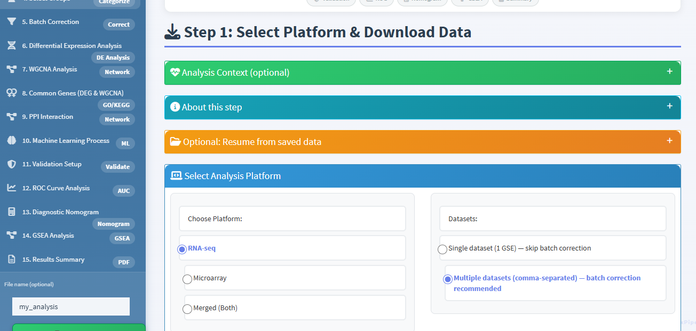
```

### Step 2 — QC & Visualization

**Sidebar:** `2. QC & Visualization`

**Goal:** Check gene overlap, inspect raw expression, and detect outlier
samples **before** normalization.

**What to do:**

1. Review **Venn** and **UpSet** plots (figure below, panel a).
2. Open **Quality Control Plots** — **Boxplot** and **Density** tabs on raw
   expression (panel b).
3. In **Sample Outlier Detection**, click **Run Outlier Detection** (panel c):
   - **PCA + Mahalanobis distance** (97.5% chi-squared threshold).
   - **Sample connectivity** (signed network; mean − 2×SD cutoff).
4. Exclude flagged samples if needed; keep **≥ 3 samples per group** after
   Step 4.
5. Review **Data Summary** (datasets, samples, genes).
6. Proceed to Step 3.

**Success check:** Overlap and QC plots look reasonable; outliers reviewed.

```{r step02a-screenshot, echo=FALSE, fig.cap="Step 2a: Venn and UpSet gene overlap.", out.width="100%"}
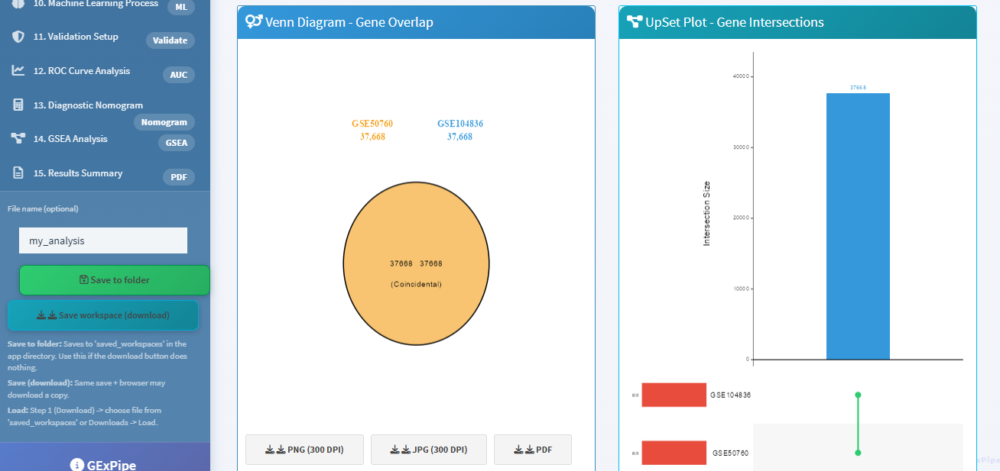
```

```{r step02b-screenshot, echo=FALSE, fig.cap="Step 2b: Raw expression boxplot.", out.width="100%"}
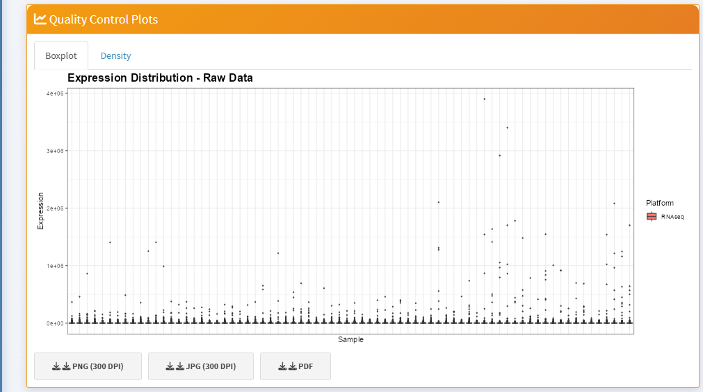
```

```{r step02c-screenshot, echo=FALSE, fig.cap="Step 2c: PCA and connectivity outlier detection.", out.width="100%"}
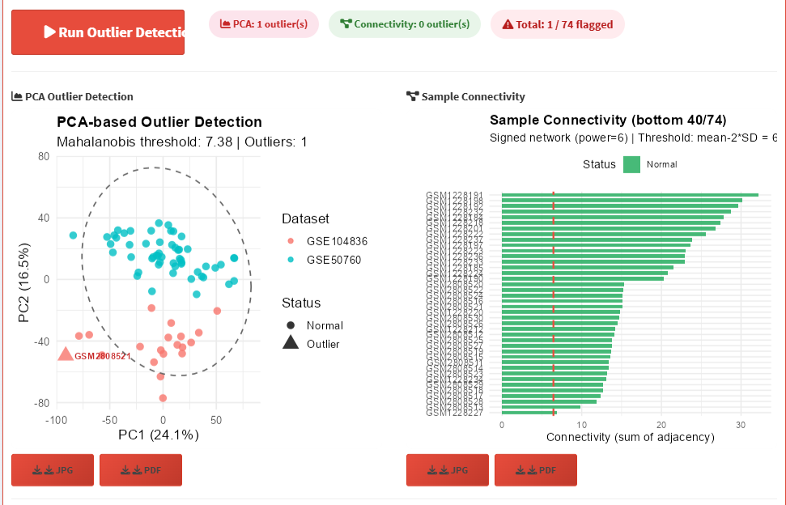
```

### Step 3 — Normalize Data

**Sidebar:** `3. Normalize Data`

**Goal:** Make expression values comparable across samples and datasets.

**What to do:**

**Count-based DE (DESeq2 / edgeR / limma-voom from Step 1):** the panel shows
**Normalization Auto-Handled** — proceed with **Go to Step 4: Select Groups**.
Background TMM + quantile still runs for WGCNA and heatmaps.

**limma path (microarray or merged):**

1. Choose **Auto** or **Manual** under **Normalization Strategy**.
2. Microarray: **Quantile** or **RMA**; RNA-seq: **TMM + log2-CPM**.
3. Toggle **Apply global quantile normalization** if appropriate.
4. Click **Apply Normalization**.
5. Scroll to **Normalization Quality Assessment** (panels a and b below):
   - Overall density and **Q–Q** plot (panel a).
   - Median/range alignment and distribution overlap (panel b).
6. Click **Next: Select Groups**.

**Success check:** Q–Q points follow the diagonal; sample medians align.

```{r step03a-screenshot, echo=FALSE, fig.cap="Step 3a: Overall density and Q-Q plots after normalization.", out.width="100%"}
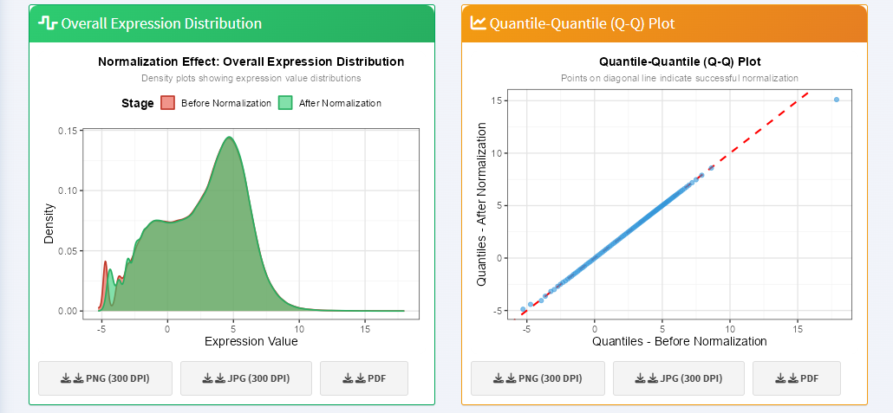
```

```{r step03b-screenshot, echo=FALSE, fig.cap="Step 3b: Median/range alignment and distribution overlap.", out.width="100%"}
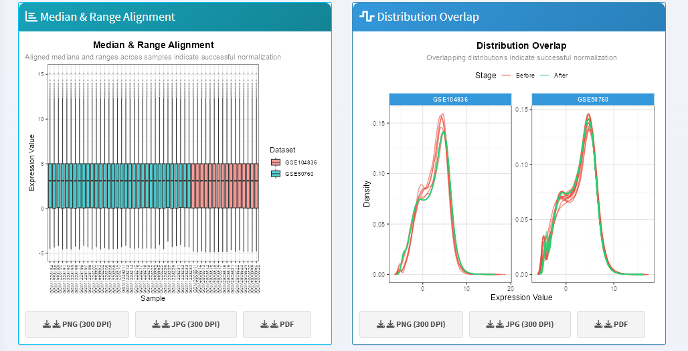
```

### Step 4 — Select Groups

**Sidebar:** `4. Select Groups`

**Goal:** Assign each sample to **Normal**, **Disease**, or **Exclude**.

**What to do:**

1. Browse **Phenodata Browser** for each GSE.
2. Under **Select Phenotype Columns** (panel a), pick the condition column
   per dataset (e.g. `characteristics_ch1`, or **`title`** when treatment is
   only in sample titles).
3. Click **Extract Groups from Selected Columns**.
4. **Categorize Groups** — map labels to reference (Normal) or comparison
   (Disease), or None.
5. Click **Apply Groups**.
6. In **Group Summary** (panel b), optionally rename groups (e.g. Control /
   Treated); click **Update**, or leave as Normal / Disease and continue.
7. Confirm sample counts, then click **Next: Batch Correction**.

**Success check:** Group Summary counts match your study design.

```{r step04a-screenshot, echo=FALSE, fig.cap="Step 4a: Select phenotype column per GSE.", out.width="100%"}
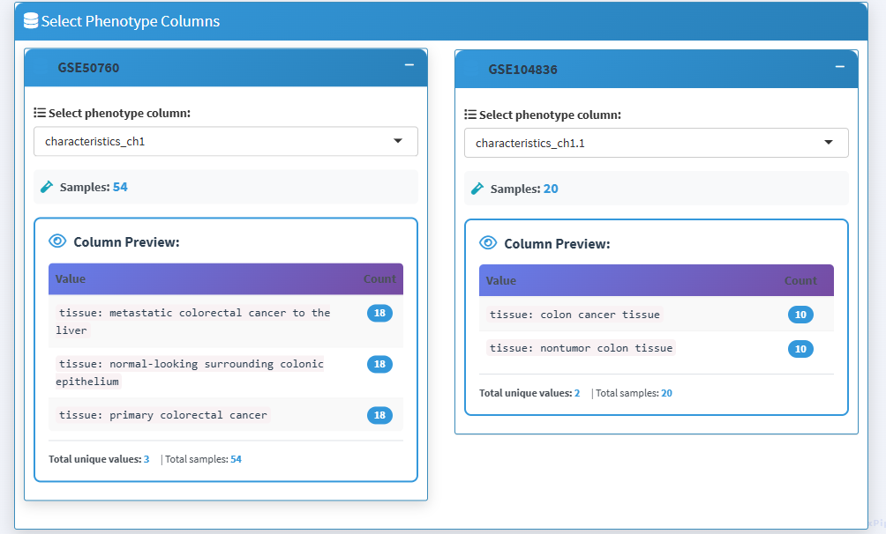
```

```{r step04b-screenshot, echo=FALSE, fig.cap="Step 4b: Group Summary after Apply Categorization.", out.width="100%"}
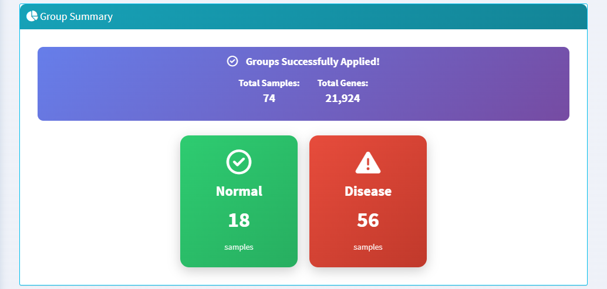
```

### Step 5 — Batch Correction

**Sidebar:** `5. Batch Correction`

**Goal:** Remove technical variation between datasets while keeping biological
Normal vs Disease signal.

**What to do:**

1. Read **Dataset × Condition confounding** — if dataset and condition are
   confounded, use **limma** or **SVA** instead of ComBat.
2. Review **Gene variance distribution**.
3. Set **Variance percentile cutoff** (panel a, default **25%**).
4. Choose **Batch correction method** (panel a, default **ComBat-ref**):
   ComBat-ref, SVA, limma, ComBat, Quantile + limma, or Hybrid.
5. Click **Apply Batch Correction**.
6. Compare **before vs after PCA by dataset** (panel b), plus PCA by
   condition, hierarchical clustering, and **PVCA** on the same panel.
7. Click **Next: Differential Expression**.

**Note:** Step 5 is skipped when only **one GSE** was loaded in Step 1.

**Success check:** After-correction PCA (panel b) shows datasets intermingled.

```{r step05a-screenshot, echo=FALSE, fig.cap="Step 5a: Variance filtering and batch correction method.", out.width="100%"}
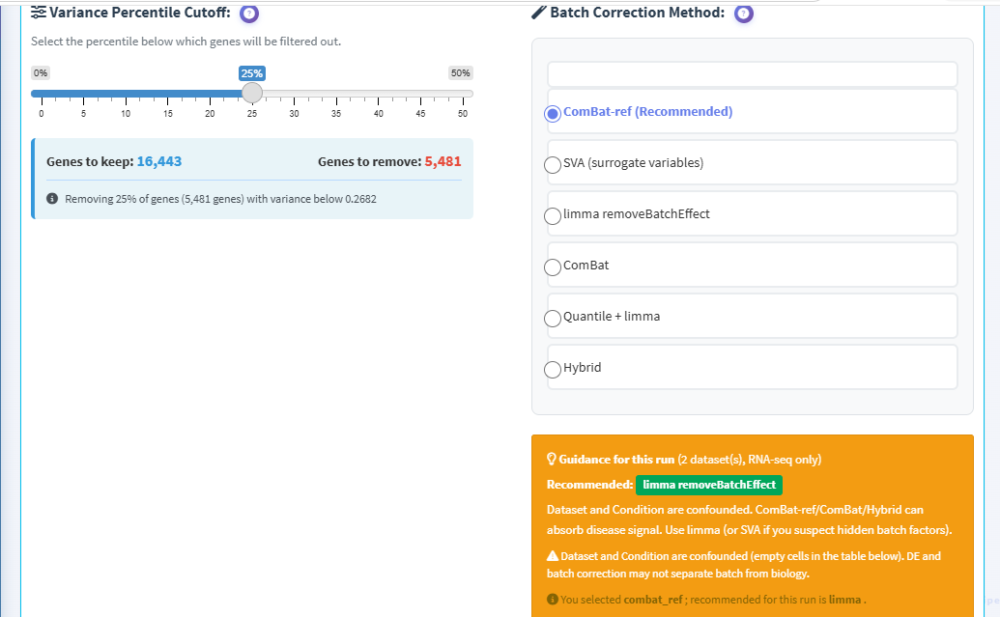
```

```{r step05b-screenshot, echo=FALSE, fig.cap="Step 5b: PCA by dataset before and after batch correction.", out.width="100%"}
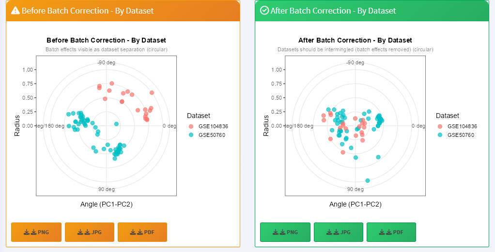
```

## Phase 2 — Gene discovery

### Step 6 — Differential Expression Analysis

**Sidebar:** `6. Differential Expression Analysis`

**Goal:** Identify genes differing between **Normal** and **Disease**.

**What to do:**

1. Confirm the **DE method banner** matches your Step 1 choice (limma,
   limma-voom, DESeq2, or edgeR).
2. Set **DE Parameters** (panel a):
   - **LogFC cutoff** (default 0.5; e.g. 1.0 for 2-fold change).
   - **Adj. P-value** (default 0.05, Benjamini–Hochberg FDR).
   - **Heatmap Genes** (number of top DEGs for the heatmap, default 50).
3. Click **Run DE Analysis**.
4. Read **Statistical model** and **Pipeline verification** — design formula,
   `filterByExpr` gene counts, samples used, and batch-in-model note.
5. Review results (panel b):
   - **Volcano plot** (up / down / not significant).
   - **Top DEGs** table and heatmap below.
6. Optionally download **Analysis report (TXT)**.
7. Click **Next: WGCNA Analysis**.

**Success check:** Volcano shows expected direction; DEG count is plausible for
your contrast; pipeline verification lists the correct method and samples.

```{r step06a-screenshot, echo=FALSE, fig.cap="Step 6a: DE parameters, statistical model, and pipeline verification.", out.width="100%"}
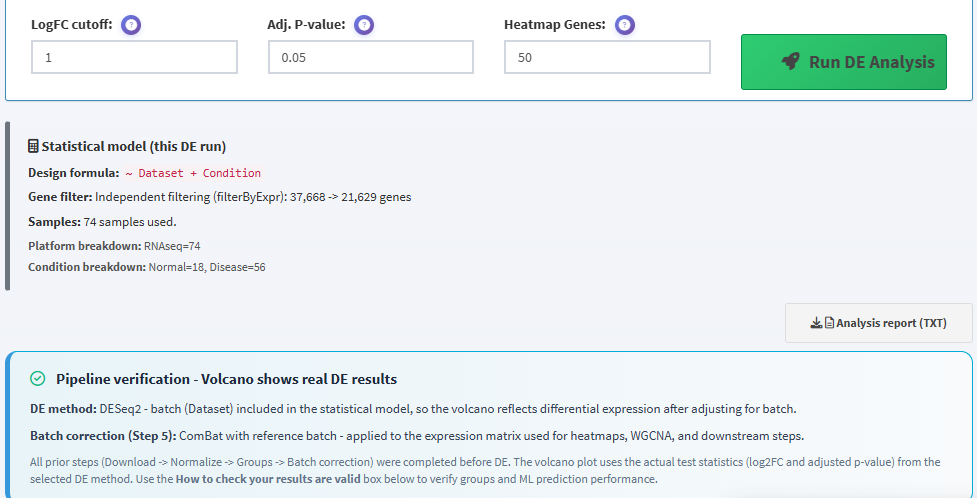
```

```{r step06b-screenshot, echo=FALSE, fig.cap="Step 6b: Volcano plot and top DEG table.", out.width="100%"}
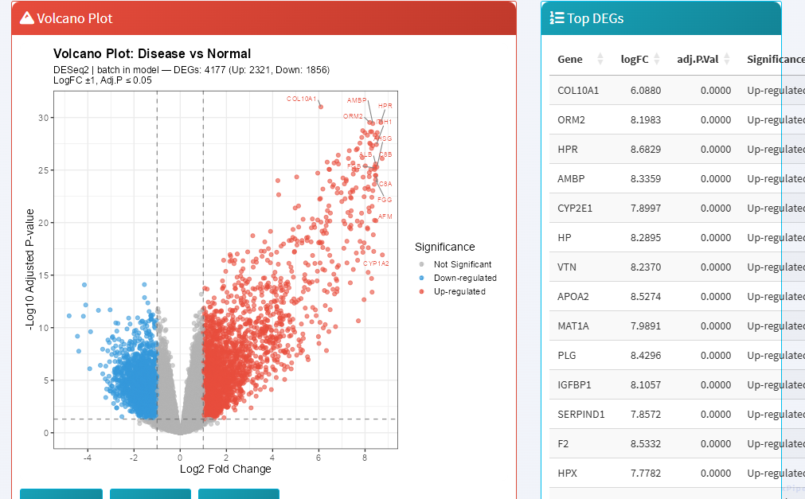
```

### Step 7 — WGCNA Network Analysis

**Sidebar:** `7. WGCNA Analysis`

**Goal:** Find co-expression modules associated with disease and extract hub
genes from significant modules.

**What to do:**

The WGCNA tab has internal sub-steps; complete them in order:

1. **Data Preparation & QC** (panel a):
   - Choose **All genes** or **Top variable genes** (e.g. 5000).
   - Set **Min samples per gene** fraction (default 0.5).
   - Click **Prepare Data**.
   - Check the sample dendrogram; exclude outliers or click **No outliers —
     proceed to Step 2** (within this tab).
2. **Pick Soft Threshold Power** (panel b):
   - Click **Calculate Power**; choose power where scale-free **R² ≥
     0.80**.
3. **Network Construction & Module Detection** (panel c):
   - Set minimum module size and merge cut height.
   - Click **Build Network**; inspect the module dendrogram and module colours.
4. **Module–trait relationships** (panel c):
   - Click **Calculate Correlations & GS/MM**; review the heatmap of
     module–condition correlations.
5. **Identify significant modules** (panel d):
   - Click **Identify Significant Modules**; note hub genes (GS/MM filters).
   - Optionally run **GS vs MM** plots for all modules.
6. Click **Next: Common Genes (DEG & WGCNA)**.

**Success check:** Soft-threshold R² ≥ 0.80; at least one module correlates
with Disease; hub genes are listed for significant modules.

```{r step07a-screenshot, echo=FALSE, fig.cap="Step 7a: WGCNA data preparation and gene selection.", out.width="100%"}
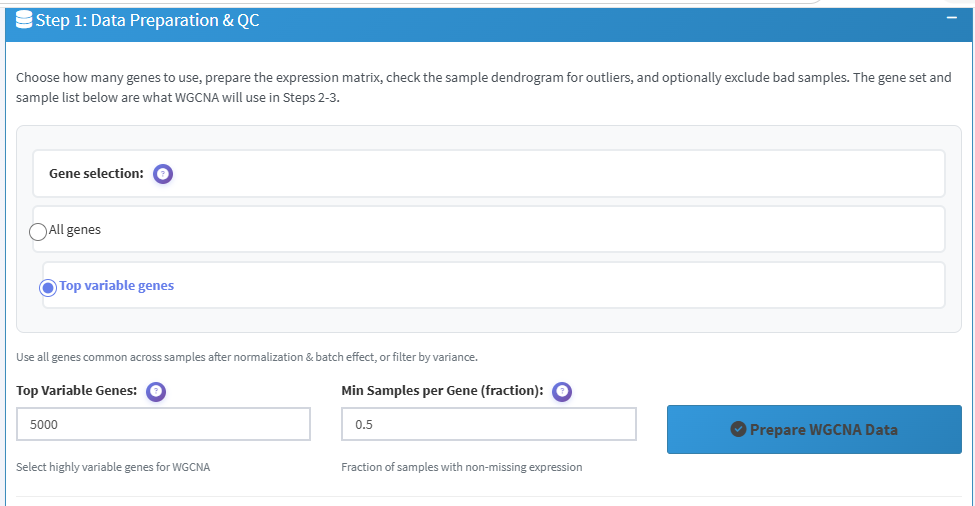
```

```{r step07b-screenshot, echo=FALSE, fig.cap="Step 7b: Soft-threshold power selection.", out.width="100%"}
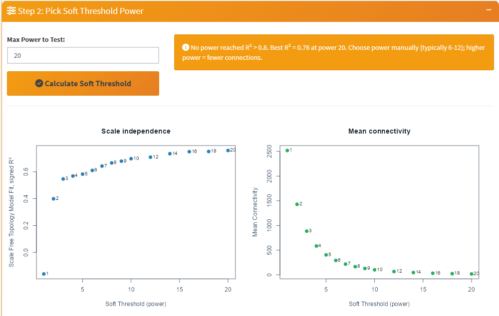
```

```{r step07c-screenshot, echo=FALSE, fig.cap="Step 7c: Module dendrogram and module-trait heatmap.", out.width="100%"}
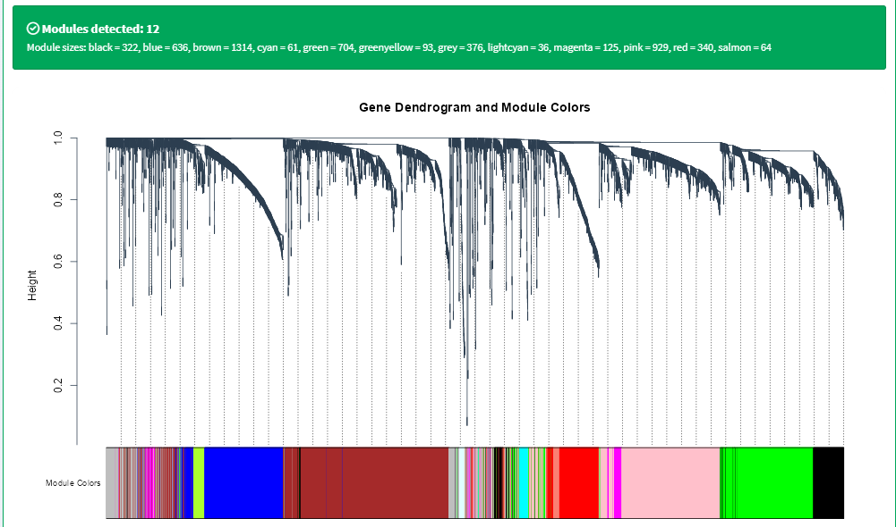
```

```{r step07d-screenshot, echo=FALSE, fig.cap="Step 7d: Significant modules and hub gene summary.", out.width="100%"}
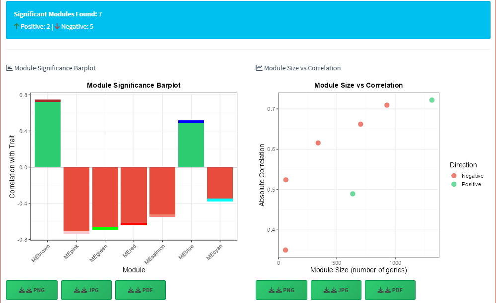
```

### Step 8 — Common Genes (DEG & WGCNA) & Enrichment

**Sidebar:** `8. Common Genes (DEG & WGCNA)`

**Goal:** Intersect DEGs (Step 6) with genes in significant WGCNA modules
(Step 7), then run GO/KEGG enrichment on the overlap.

**What to do:**

1. Click **Compute Common Genes** (panel a).
2. Review the summary counts and **Venn diagram: DEG ∩ WGCNA**.
3. Download the common-gene table (CSV) if needed.
4. Click **Run GO Enrichment** (panel b) on the common genes — dot plots for
   BP, MF, and CC.
5. Click **Run KEGG Enrichment** (panel c) — bar plot and chord diagram.
6. Choose next path at the bottom of the tab:
   - **Path 1: PPI Interaction → then ML**, or
   - **Path 2: Direct to Machine Learning**.

**Requirements:** Steps 6 and 7 (including **Identify Significant Modules**)
must be complete.

**Success check:** Venn overlap > 0; GO/KEGG plots show interpretable terms.

```{r step08a-screenshot, echo=FALSE, fig.cap="Step 8a: Common genes Venn diagram (DEG intersect WGCNA).", out.width="100%"}
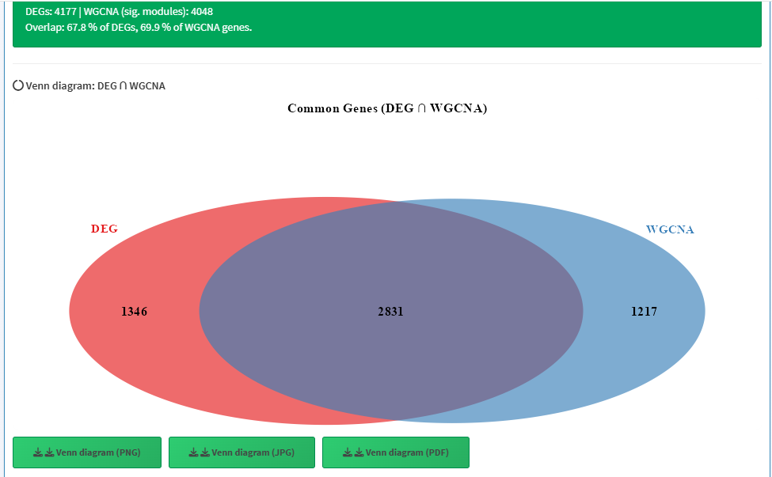
```

```{r step08b-screenshot, echo=FALSE, fig.cap="Step 8b: GO enrichment of common genes.", out.width="100%"}
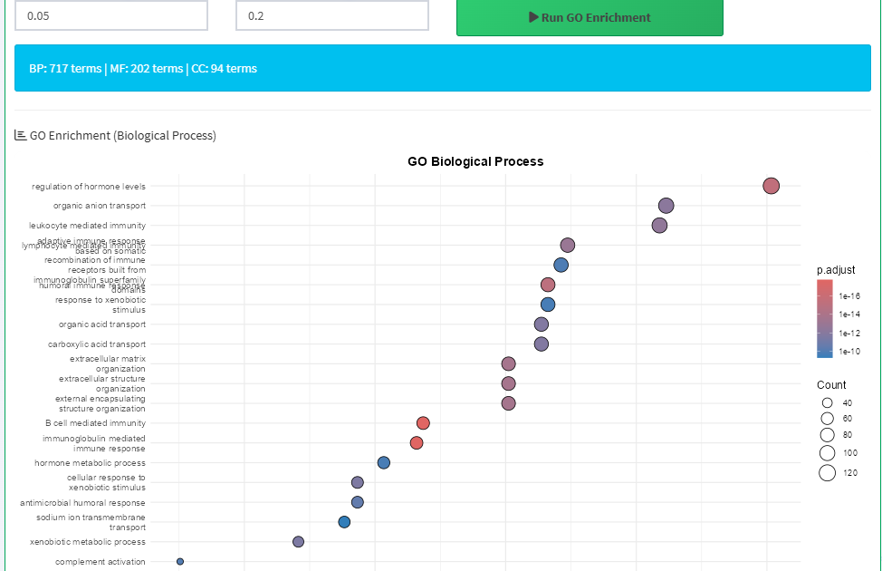
```

```{r step08c-screenshot, echo=FALSE, fig.cap="Step 8c: KEGG enrichment of common genes.", out.width="100%"}
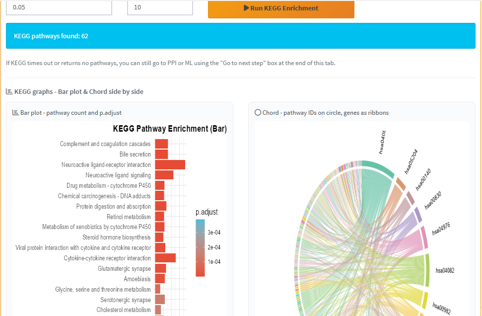
```

## Phase 3 — Candidate refinement

### Step 9 — PPI Interaction

**Sidebar:** `9. PPI Interaction`

**Goal:** Map common genes onto a STRING protein–protein interaction network
and identify hub proteins.

**What to do:**

1. Set **STRING score threshold** (default 400; 150–900).
2. Click **Run PPI Analysis** (panel a).
3. Review **Interactive vs non-interactive** gene counts and table.
4. Choose genes for network view: **Hub genes only**, **Top N by degree**, or
   **Select genes manually**; click **Run**.
5. Inspect PPI network layouts (panel b) and **consensus hub** table.
6. Click **Extract Data for ML** (required before Step 10).
7. Click **Next: Machine Learning Process**.

**Requirements:** Step 8 common genes computed.

**Success check:** Network builds with mapped edges; hub genes listed;
ML extract succeeds.

```{r step09a-screenshot, echo=FALSE, fig.cap="Step 9a: Run PPI and interactive vs non-interactive gene table.", out.width="100%"}
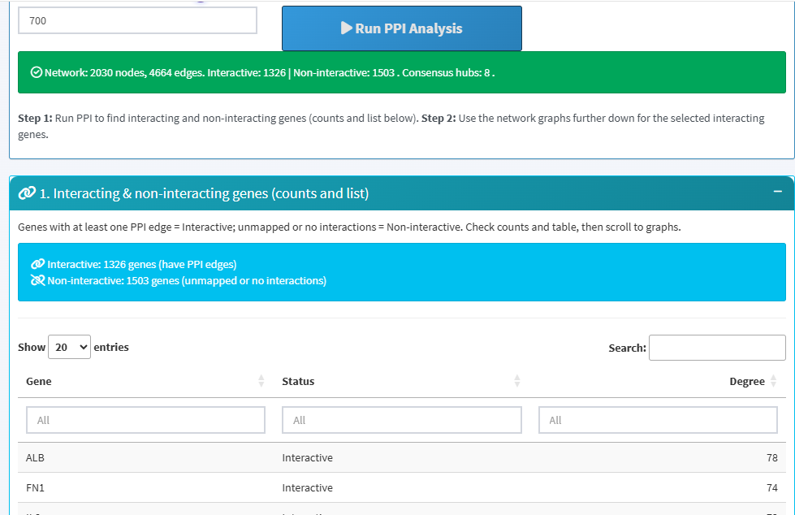
```

```{r step09b-screenshot, echo=FALSE, fig.cap="Step 9b: PPI network graph and hub gene metrics.", out.width="100%"}
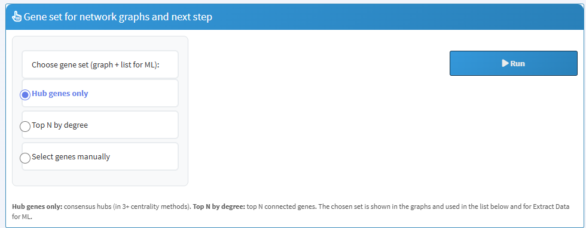
```

### Step 10 — Machine Learning Process

**Sidebar:** `10. Machine Learning Process`

**Goal:** Rank genes by predictive importance using multiple ML algorithms and
find genes selected by ≥ 2 methods.

**What to do:**

1. Confirm **Extract Data for ML** was run on the PPI tab (Step 9).
2. Under **Run ML Analysis** (panel a), select one or more methods:
   LASSO, Elastic Net, Ridge, Random Forest, SVM-RFE, Boruta, sPLS-DA,
   XGBoost+SHAP.
3. Set **Top N** per method where shown.
4. Click **Run ML Analysis**.
5. Review **Venn diagram (selected methods)** and the **common ML genes**
   table (panel b) — genes in ≥ 2 methods form the candidate panel.
6. Inspect per-method importance plots (RF, Elastic Net, etc.).
7. Click **Continue to Validation Setup**.

**Note:** If glmnet fails after install, restart R and relaunch the app.

**Success check:** At least one common ML gene; Venn overlap across methods
is non-empty.

```{r step10a-screenshot, echo=FALSE, fig.cap="Step 10a: Select ML methods and run analysis.", out.width="100%"}
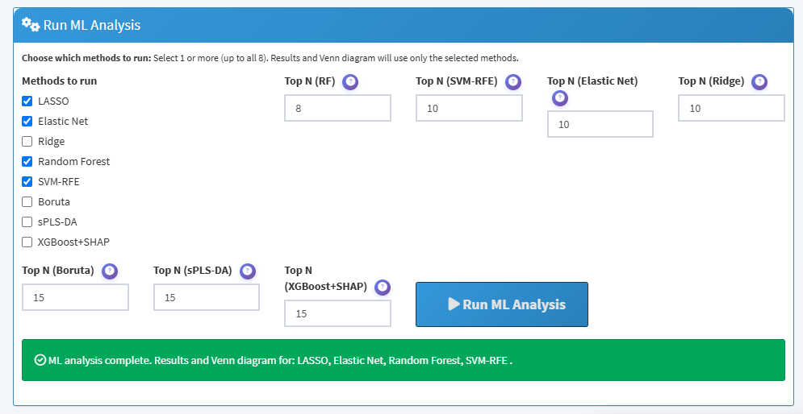
```

```{r step10b-screenshot, echo=FALSE, fig.cap="Step 10b: Method overlap Venn diagram and common ML genes.", out.width="100%"}
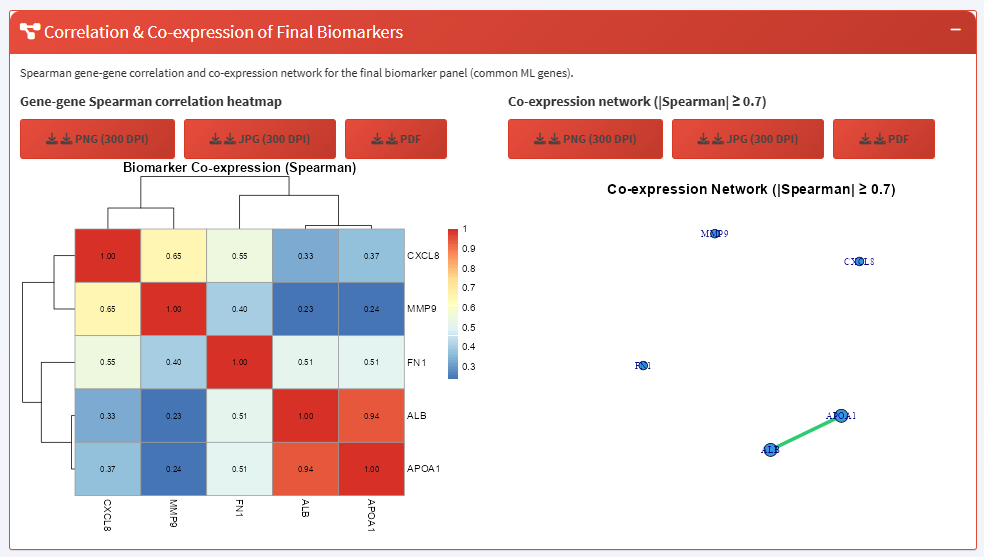
```

### Step 11 — Validation

**Sidebar:** `11. Validation Setup`

**Goal:** Test generalization on an external GEO cohort or an internal
70/30 train–test split. Target accuracy ≥ 70%.

**What to do:**

1. Choose **Validation Strategy** (panel a):
   - **External Validation** — download an independent GSE, categorize groups,
     and run DE on the validation cohort.
   - **Internal Validation** — use a 70/30 stratified split of your current
     data (no extra download).
2. **External path only:**
   - Enter validation **GSE IDs**, select **Platform Type** and **DE Method**.
   - Click **Download**, then browse phenodata and select the group column.
   - Categorize labels as Normal / Disease and click **Run Validation DE**.
3. Review validation status and DE results (panel b).
4. Click **Continue to ROC Curve Analysis**.

**Requirements:** Step 10 ML analysis complete with at least one common ML gene.

**Success check:** External mode shows downloaded samples and validation DE
results; internal mode confirms the 70/30 split is ready for ROC and nomogram.

```{r step11a-screenshot, echo=FALSE, fig.cap="Step 11a: Validation mode and external validation settings.", out.width="100%"}
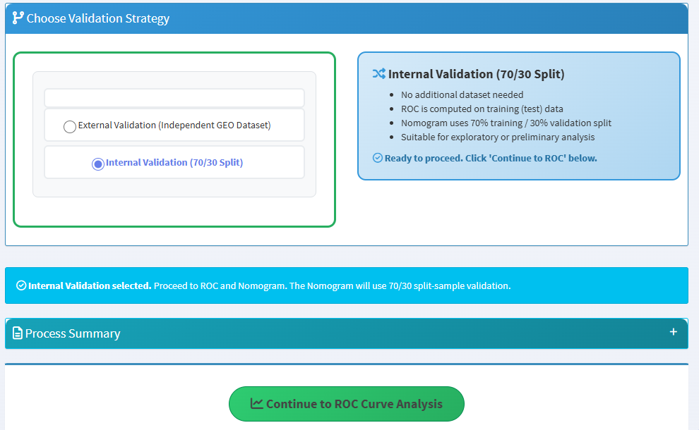
```

```{r step11b-screenshot, echo=FALSE, fig.cap="Step 11b: External validation DE results.", out.width="100%"}
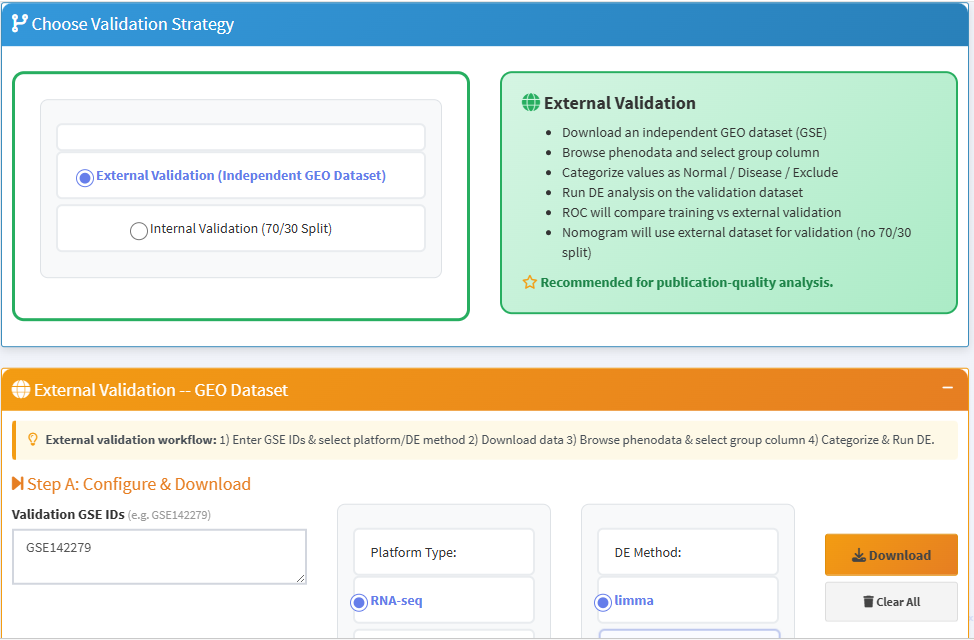
```

### Step 12 — ROC Analysis

**Sidebar:** `12. ROC Curve Analysis`

**Goal:** Per-gene AUC with 95% CI (`r BiocStyle::CRANpkg("pROC")`).
Retain genes with AUC ≥ 0.80 in training and validation.

**What to do:**

1. Review **AUC Summary — Training Data** (panel a): table and bar plot for
   common ML genes with AUC ≥ 0.80.
2. Inspect **ROC Curves — Training Data** and per-gene expression boxplots.
3. If external validation was run in Step 11, compare training vs validation
   AUC in the summary and external ROC panels (panel b).
4. Review **Multi-variable ROC** (combined biomarker panel vs best single gene).
5. Under **Select Final Biomarker Genes**, choose genes to carry forward to
   nomogram and GSEA (defaults to all common ML genes if none selected).
6. Click **Continue to Diagnostic Nomogram**, **Continue to GSEA Analysis**, or
   **View Results Summary**.

**Requirements:** Step 10 common ML genes; Step 11 validation mode selected.

**Success check:** At least one gene with training AUC ≥ 0.80; validation AUC
reported when external data are loaded.

```{r step12a-screenshot, echo=FALSE, fig.cap="Step 12a: Training ROC curves and AUC summary.", out.width="100%"}
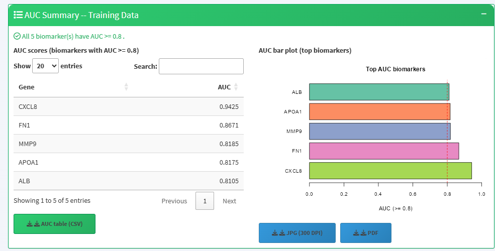
```

```{r step12b-screenshot, echo=FALSE, fig.cap="Step 12b: Training vs validation AUC comparison.", out.width="100%"}
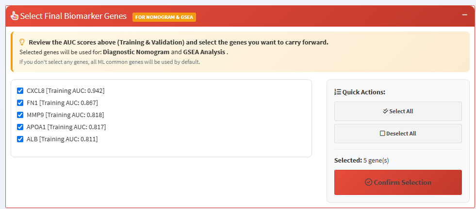
```

## Phase 4 — Clinical translation

The sidebar tabs for this phase are **13. Diagnostic Nomogram Model**,
**14. GSEA Analysis**, and **Results Summary**.

### Step 13 — Nomogram

**Sidebar:** `13. Diagnostic Nomogram Model`

**Goal:** Build a points-based clinical score (`rms::lrm()`),
calibration curve, and decision curve analysis.

**What to do:**

1. Confirm the validation mode banner (external or internal 70/30 split).
2. Click **Run Nomogram Analysis**.
3. Review outputs in order:
   - **Panel A:** nomogram (points scale).
   - **Panel B:** training and validation ROC curves.
   - **Panel C:** calibration curves.
   - **Panel D:** decision curve analysis (DCA).
   - **Panel E:** clinical impact curves.
4. Inspect **Model Diagnostics** (VIF, coefficients) and **Performance
   Comparison** (training vs validation).
5. Click **Continue to GSEA Analysis** or **View Results Summary**.

**Requirements:** Batch correction (Step 5), group metadata, and common ML
genes from Step 10 (or common DEG ∩ WGCNA genes from Step 8).

**Success check:** Nomogram renders; training AUC is reasonable; validation
metrics match your chosen validation strategy.

```{r step13-screenshot, echo=FALSE, fig.cap="Step 13: Nomogram, calibration, and decision curves.", out.width="100%"}
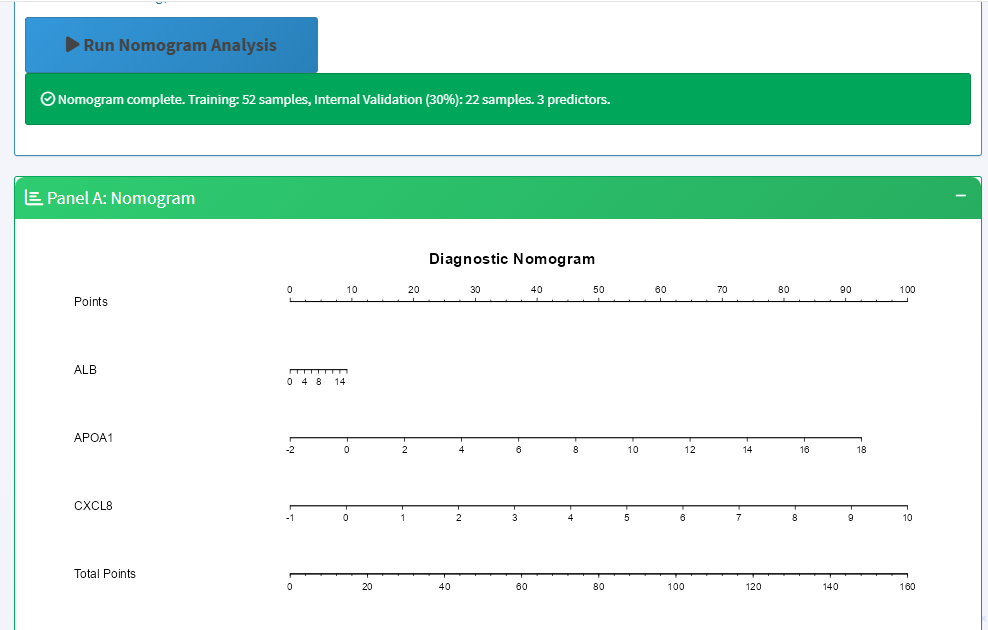
```

### Step 14 — GSEA

**Sidebar:** `14. GSEA Analysis (Signature Genes)`

**Goal:** Pathway-level enrichment (GO, KEGG, MSigDB Hallmark/C2/C5)
stratified by final gene expression.

**What to do:**

1. Select one or more **Gene Set Collection(s)** (Hallmark, GO BP/MF, KEGG,
   Reactome, etc.).
2. Optionally enter **Custom target genes**; leave blank to use common ML genes
   (or genes selected in Step 12).
3. Click **Run GSEA**.
4. For each target gene, review the enrichment plot and pathway list in the
   per-gene panels below.
5. Click **Continue to Results Summary**.

**Requirements:** Batch-corrected expression and common ML genes from Step 10
(or Step 8 overlap).

**Success check:** GSEA completes for each target gene; enrichment plots and
pathway tables are interpretable.

```{r step14-screenshot, echo=FALSE, fig.cap="Step 14: GSEA enrichment plots per signature gene.", out.width="100%"}
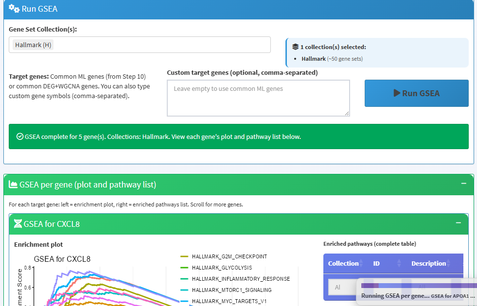
```

### Step 15 — Summary Report

**Sidebar:** `Results Summary`

**Goal:** Review the full pipeline narrative and key figures, then download
exports where available.

**What to do:**

1. Read the **Pipeline summary** narrative at the top.
2. Scroll through step cards for normalization, batch correction, DE, WGCNA,
   common genes, GO/KEGG, PPI, ML, ROC, nomogram, and GSEA — each with a
   short description and figure.
3. Use download buttons on individual plots (JPG/PDF) where you need figures
   for a manuscript or report.
4. Expand **Cite this analysis** for package and method references.

**Success check:** Summary reflects your completed steps; key plots from
earlier tabs appear in the ordered overview.

```{r step15-screenshot, echo=FALSE, fig.cap="Step 15: Results summary overview.", out.width="100%"}

```

# Gene ID mapping (mixed studies) {#gene-id-mapping-mixed-studies}

When you merge **multiple GEO microarray** series, row names are often
probe IDs, Ensembl IDs, or GenBank accessions — not HGNC symbols. GExPipe
detects the format per GSE and converts to symbols in **STEP 2b** before
computing the gene intersection.

```{r id-formats}
library(GExPipe)

detect_fmt <- getFromNamespace("detect_gene_id_format", "GExPipe")
need_conv <- getFromNamespace("gexpipe_ids_need_symbol_conversion", "GExPipe")

examples <- list(
  "HGNC symbols"              = c("TP53", "BRCA1", "EGFR"),
  "Arraystar / custom probes" = c("(+)E1A_r60_1", "ASHGV40000001"),
  "Affymetrix Ensembl probes" = c("ENSG00000000003_at", "ENSG00000000005_at"),
  "GenBank accessions"        = c("AB000409", "AB000463", "AB000781")
)

id_table <- data.frame(
  Example = names(examples),
  Detected_format = vapply(examples, detect_fmt, character(1)),
  Needs_symbol_conversion = vapply(examples, need_conv, logical(1)),
  check.names = FALSE
)
knitr::kable(id_table, caption = "How GExPipe classifies common GEO row ID types.")
```

**Arraystar GPL21827** (e.g. `GSE188653`) has no gene-symbol column on GEO;
GExPipe crosswalks V4 probe IDs to **GPL26963** annotation (ORF / accession
→ symbol). Control probes such as `(+)E1A_r60_*` are dropped. Ensure
`org.Hs.eg.db` and `biomaRt` are installed for full conversion.

Example platforms in a four-study microarray merge:

| GSE | GPL | Row ID style |
|-----|-----|----------------|
| GSE188653 | GPL21827 | Arraystar V4 probes `(+)E1A_r60_*`, `ASHGV…` |
| GSE207304 | GPL26963 | Arraystar V5 probes `ASHG19AP…V5` |
| GSE211729 | GPL30033 | Affymetrix Ensembl `ENSG*_at` |
| GSE92252 | GPL16025 | GenBank accessions `AB000409` |

Demonstration with two small matrices (symbols only — no network):

```{r id-overlap-demo}
genes <- c("TP53", "BRCA1", "EGFR", "MYC", "GAPDH", "ACTB")
set.seed(11)
m1 <- matrix(abs(rnorm(length(genes) * 4)), nrow = length(genes),
             dimnames = list(genes, paste0("GSE1_S", 1:4)))
m2 <- matrix(abs(rnorm(length(genes) * 4)), nrow = length(genes),
             dimnames = list(genes, paste0("GSE2_S", 1:4)))

overlap_out <- gexp_download_normalize_ids_for_overlap(
  micro_expr_list = list(GSE1 = m1, GSE2 = m2),
  rna_counts_list = list()
)
fin <- gexp_download_finalize_common_genes(
  micro_expr_list = overlap_out$micro_expr_list,
  rna_counts_list = overlap_out$rna_counts_list,
  all_genes_list  = overlap_out$all_genes_list
)
cat(
  overlap_out$log_text,
  "\nCommon genes after merge:", length(fin$common_genes), "\n"
)
```

# Programmatic example (bundled data) {#programmatic-example-bundled-data}

The Shiny app is the recommended interface. The functions below let you
script normalization and QC plots using the **example data** bundled with
the package.

## Load package and example data

```{r load-data}
library(ggplot2)

expr_tab <- read.csv(
  system.file("extdata", "vignette_expression.csv", package = "GExPipe"),
  check.names = FALSE, stringsAsFactors = FALSE
)
meta_tab <- read.csv(
  system.file("extdata", "vignette_sample_metadata.csv", package = "GExPipe"),
  check.names = FALSE, stringsAsFactors = FALSE
)

expr <- as.matrix(expr_tab[, -1L, drop = FALSE])
storage.mode(expr) <- "numeric"
rownames(expr) <- expr_tab[[1L]]

rownames(meta_tab) <- meta_tab$SampleID
meta_tab <- meta_tab[colnames(expr), , drop = FALSE]

dim(expr)
head(meta_tab)
```

## Normalize and intersect datasets

`gexp_normalize_and_intersect()` normalizes each dataset, intersects
genes, and returns a combined matrix.

```{r normalize}
if (!"Dataset" %in% colnames(meta_tab))
    meta_tab$Dataset <- "D1"

datasets <- unique(meta_tab$Dataset)
micro_expr_list <- setNames(
    lapply(datasets, function(ds) {
        ids <- rownames(meta_tab)[meta_tab$Dataset == ds]
        expr[, ids, drop = FALSE]
    }),
    datasets
)

norm_res <- gexp_normalize_and_intersect(
    micro_expr_list    = micro_expr_list,
    rna_counts_list    = list(),
    micro_norm_method  = "quantile",
    rnaseq_norm_method = "TMM",
    de_method          = "limma"
)

cat("Combined matrix :", paste(dim(norm_res$combined_expr), collapse = " x "), "\n")
cat("Common genes    :", length(norm_res$common_genes), "\n")
```

## Principal component analysis

```{r pca-plot}
expr_pca <- norm_res$combined_expr
keep     <- apply(expr_pca, 1L, var, na.rm = TRUE) > 1e-8
pca      <- prcomp(t(expr_pca[keep, ]), center = TRUE, scale. = TRUE)

pca_df <- data.frame(
    PC1     = pca$x[, 1L],
    PC2     = pca$x[, 2L],
    Dataset = meta_tab[rownames(pca$x), "Dataset"],
    stringsAsFactors = FALSE
)
var_pct <- round(summary(pca)$importance[2L, 1L:2L] * 100, 1)

ggplot(pca_df, aes(PC1, PC2, colour = Dataset)) +
    geom_point(size = 3) +
    theme_minimal() +
    labs(
        title    = "PCA - bundled example data",
        subtitle = "After quantile normalization and gene intersection",
        x        = paste0("PC1 (", var_pct[1L], "% variance)"),
        y        = paste0("PC2 (", var_pct[2L], "% variance)")
    )
```

## Expression heatmap

```{r heatmap-plot}
top_var <- head(
    order(apply(norm_res$combined_expr, 1L, var, na.rm = TRUE),
          decreasing = TRUE),
    min(30L, nrow(norm_res$combined_expr))
)

if (length(top_var) > 1L) {
    pheatmap::pheatmap(
        norm_res$combined_expr[top_var, , drop = FALSE],
        scale         = "row",
        show_rownames = length(top_var) <= 30L,
        main          = "Top 30 most variable genes - bundled example data"
    )
}
```

# Troubleshooting {#troubleshooting}

| Problem | Solution |
|------------------------------------|------------------------------------|
| **0 common genes after download** | Use [latest code](#run-latest-code). Check STEP 2b in the log. Install `org.Hs.eg.db` and `biomaRt`. For Arraystar (`GSE188653`), allow GPL26963 to download once (cached under `micro_data/`). |
| **IDs still probe-like in log** | Restart R; use [Run latest code](#run-latest-code) — an old install skips STEP 2b fixes. |
| **Download log says `Code source: installed`** | You are not on the GitHub clone; use `runGitHub(..., ref = "main")` or `pkgload::load_all()`. |
| **Locked DLL files (Windows)** | Restart R (`Ctrl+Shift+F10`) before installing or launching. |
| **Missing C++ compiler** | Install [Rtools](https://cran.r-project.org/bin/windows/Rtools/) (Windows). |
| **glmnet / ML step skipped** | Restart R after install; ensure glmnet ≥ 4.x or 5.x loads (`packageVersion("glmnet")`). |
| **Version conflicts** | `remotes::install_github("safarafique/GExPipe", ref = "main", force = TRUE, INSTALL_opts = "--no-staged-install")`. |
| **Corrupt lazy-load database** | Reinstall with `INSTALL_opts = "--no-staged-install"`. |
| **Corporate proxy** | `Sys.setenv(https_proxy = "http://proxy:port")` before installing. |

```{r windows-fix, eval=FALSE}
options(download.file.method = "wininet")
unlink(
    list.files(.libPaths()[1], pattern = "^00LOCK-", full.names = TRUE),
    recursive = TRUE, force = TRUE
)
if (!requireNamespace("remotes", quietly = TRUE))
    install.packages("remotes")
remotes::install_github(
  "safarafique/GExPipe",
  ref = "main",
  dependencies = TRUE,
  INSTALL_opts = "--no-staged-install"
)
```

# Session Information

```{r session-info}
sessionInfo()
```
